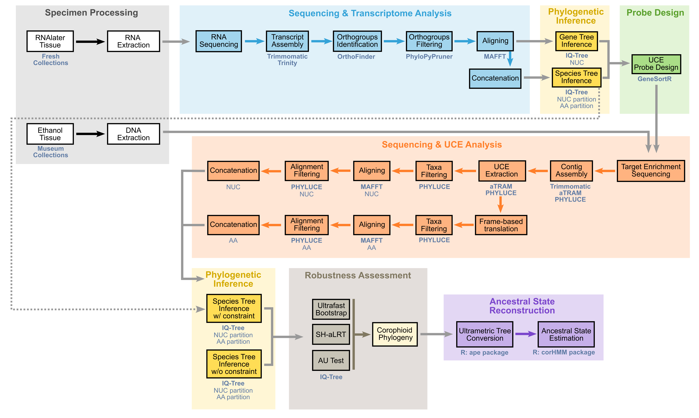
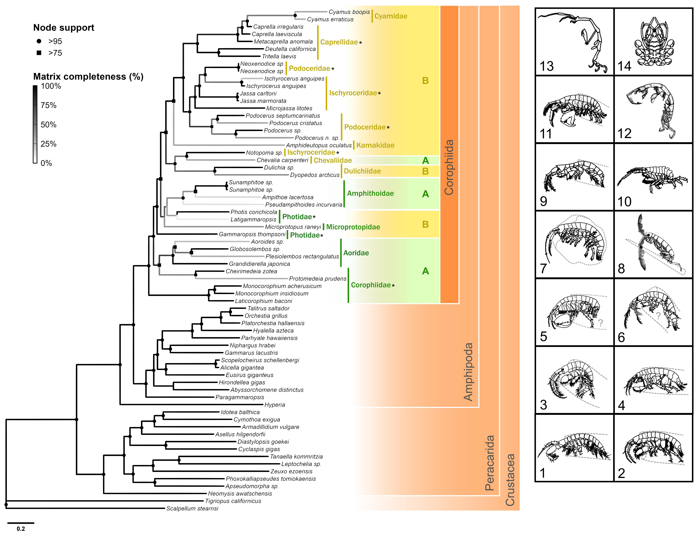
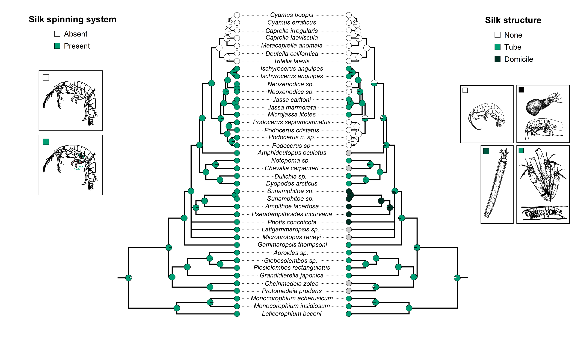

# Corophiidan Phylogenomics Pipeline

## Overview

This repository contains the analytical workflow used to reconstruct evolutionary relationships among corophiidan amphipods and investigate the origins of major morphological and ecological innovations within the group.

The project integrates transcriptomic, genomic, and target-capture sequencing datasets to infer species relationships, identify phylogenetically informative loci, examine character evolution, and test hypotheses regarding the diversification of amphipod body forms, lifestyles, and silk-spinning systems.

<p align="center">
  
</p>

---

## Analytical Components

### Sequence Processing

* Quality assessment and filtering
* Transcriptome assembly
* Assembly completeness evaluation
* Contaminant detection and removal
* Coding sequence extraction and translation

### Orthology Inference

* Ortholog identification
* Paralog pruning
* Occupancy filtering
* Dataset construction
* Ortholog quality assessment

### Phylogenetic Reconstruction

* Amino acid and nucleotide alignments
* Gene tree estimation
* Concatenated species tree inference
* Support assessment and topology comparison
* Species-tree reconstruction

### Marker Development

* Ortholog ranking
* Target-capture marker selection
* Probe design preparation
* Locus performance assessment

### Comparative Analyses

* Character evolution analyses
* Ancestral state reconstruction
* Trait diversification studies
* Evolutionary hypothesis testing

### Visualization & Reporting

* Phylogenetic tree visualization
* Dataset summaries
* Publication-quality figure generation
* Reproducible documentation

---

## Software & Tools

Primary analyses utilized:

* Bash
* Perl
* R
* Trinity
* BUSCO
* EvidentialGene
* Diamond
* Alien Index
* OrthoFinder
* PhyloPyPruner
* MAFFT
* PAL2NAL
* IQ-TREE
* PHYLUCE
* genesortR

---

## Computational Environment

The workflow was developed and executed in Linux environments using high-performance computing resources.

Key components include:

* Linux/Unix command-line workflows
* Bash and Perl scripting
* Workflow automation
* Parallel computing
* Large-scale phylogenomic dataset processing

---

## Research Applications

This workflow demonstrates approaches for:

* Phylogenomic analysis of non-model organisms
* Orthology inference and filtering
* Species-tree reconstruction
* Target-capture marker development
* Comparative evolutionary analyses
* Reproducible bioinformatics pipeline development

---

## Repository Structure

```text
├── protocol/
│   └── Corophiidan_Phylogenomics_Protocol.md
├── scripts/
│   ├── bash/
│   ├── perl/
│   └── r/
├── figures/
├── outputs/
└── README.md
```

---

## Example Outputs

<p align="center">
  
  
</p>

---

## Associated Research

Cummings, B.C. *Unraveling Amphipod Diversity Across Phylogenetic, Phenotypic, and Community Scales*. PhD Dissertation, University of Florida (2026).

Cummings, B.C., Kocot, K.M., Ryan, J.F., & Paulay, G. *Phylogenomics of Corophiidan Amphipods: The Silk Road to Divergent Body Types and Lifestyles*. Manuscript in preparation.

---

## Author

**Brittany Cummings, PhD**

Evolutionary Genomics Researcher

Research interests: phylogenomics, computational biology, biodiversity genomics, molecular systematics, and evolutionary biology.
